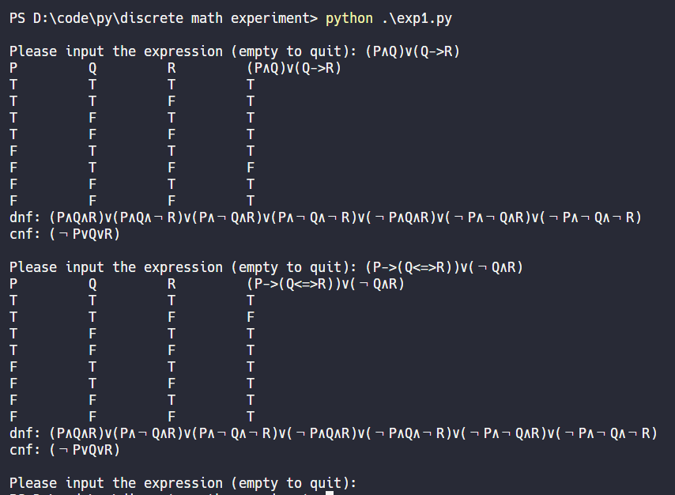
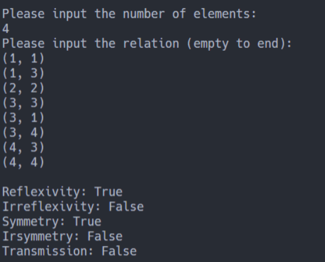
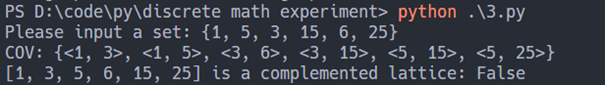

# 离散实验

## 实验一：真值表法求取主析取范式以及主合取范式

### 实验原理
使用**堆栈**，先将中缀表达式转化为后缀表达式，再利用后缀表达式求出命题的真值，最后输出真值表和主析取范式以及主合取范式

### 实现效果
能够（只能）实现3个变量、5种联结词以及带括号的表达式的解析，求真值表、主析取范式和主合取范式。




## 实验二： 编程实现任意集合上二元关系的性质判定

### 实验原理
先把二元关系用关系矩阵表示，那么判断关系的性质就比较轻松。

**自反**的二元关系R相应的关系矩阵主对角线元素都为1；

**反自反**的二元关系R相应的关系矩阵主对角线元素都为0；

**对称**的二元关系R相应的关系矩阵也是对称的；

**反对称**的二元关系R相应的关系矩阵也是反对称的(这里定义1的反为0)；

对**传递**的二元关系R，相应的关系矩阵R中若$r_{ij}=1$,$r_{jk}=1$，则$r_{ik}=1$。

可以利用Python里的`numpy`库以及`lambda函数式`轻松地解决关系性质的判定。

### 实现效果



## 实验三：编程实现整除关系这一偏序关系上所有盖住关系的求取，并判定对应偏序集是否为格

### 实验原理

- 先找出所有整除关系
- 再暴力求出所有盖住关系
- 是否为**有补格**：任意两个元素的最大公约数（最大下界）== 这个集合的最小元 && 任意两个元素的最小公倍数（最大上界）== 这个集合的最大元

### 实现效果



## 实验四：编程随机生成*n*个结点的无向图并能进行（半）欧拉图的判定，若是则给出欧拉（回）路

### 实验原理

- 判断是否为（半）欧拉图：邻接矩阵必须是对称的且G是连通的，且有零个或两个奇数度结点。
  - G是否连通可以根据计算可达矩阵来判断；
  - 每一个结点的度数可以根据邻接矩阵里这一行的和来计算。
  - 如果有两个奇数度结点，则为半欧拉图；如果有零个奇数度结点，则为欧拉图。

如果是（半）欧拉图，则需要给出至少一条欧拉回路或者欧拉路。

- 先确定起点和终点：
  - 如果是半欧拉图，则找到那两个奇数度结点，分别作为起点和终点；
  - 如果是欧拉图，则默认以第一个结点为起点和终点。
- 然后从起点出发，不断地找到下一个结点，并删去已经过的结点的度数，直至所剩的度数为2，再走到终点。

### 实现效果

```
Please input the number of nodes: 2
Matrix:
[[False False]
 [ True False]]
The graph is not a Eulerian graph.

Please input the number of nodes: 2
Matrix:
[[False  True]
 [ True False]]
The graph is a semi-Eulerian graph.
[(0, 1)]

Please input the number of nodes: 3
Matrix:
[[False False False]
 [ True False False]
 [ True  True False]]
The graph is not a Eulerian graph.

Matrix:
[[False  True  True]
 [ True False  True]
 [ True  True False]]
The graph is a Eulerian graph.
[(0, 1), (1, 2), (2, 0)]
```

